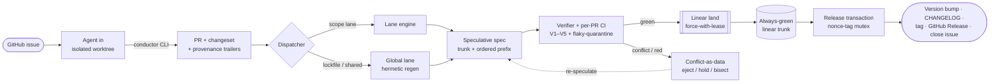

# Conductor

**A GitHub-native integration & governance layer for fleets of unattended AI coding agents.**

Conductor lets tens of AI agents — each in an isolated git worktree — land work onto a single
mainline while preserving a clean **linear history**, an accurate **CHANGELOG**, **GitHub-issue
traceability**, **semantic versioning**, and an auditable **single source of truth**.


> **Premise:** don't reinvent git's object model — reinvent the *control plane* around it.
> No vendor products and no off-the-shelf core packages in the critical path (no
> Aviator/Mergify/Graphite, no `@changesets`, no semantic-release). GitHub's own primitives
> — API, Actions, Rulesets, Apps, git refs — are the platform. The merge engine, conflict
> router, flaky-quarantine, correctness verifier, and version backend are ours, built from
> scratch in Python with **zero dependencies**.

---

## The problem

Worktrees solve *file* isolation for a fleet of agents. They don't solve **integration**:
how do tens of concurrent, autonomous writers land on one trunk without races, silent
reverts, lost changelogs, or untraceable history? "Just rebase to main" throws away the
review gate, the audit trail, and atomicity. Conductor is the missing control plane.

Agents never push trunk and never self-rebase. Every unit of work is a GitHub issue → an
isolated worktree branch → a PR carrying a unique changeset fragment and provenance trailers.
A **scope-partitioned speculative merge engine** serializes integration, lands only
already-green specs by linear fast-forward, turns conflicts into data, and cuts releases
exactly once.

## How it works



**The serialization core:** durable state lives in orphan git refs (`refs/conductor/*`)
committed by identity-leased fast-forward push; trunk advances only via
`git push --force-with-lease` to an already-green spec, behind a linear-history Ruleset.
Because trunk is never written speculatively, the native merge-queue **silent-revert failure
mode is structurally impossible**. GitHub is the single source of truth; a committed JSONL
provenance ledger is a rebuildable projection only.

## Highlights

- **Always-green linear trunk** — speculative specs are built and tested *off* trunk; trunk
  only fast-forwards to a proven-green tip.
- **Exactly-once everything** — land recording and releases survive a killed runner
  (intent → advance → confirm, reconciler replay, nonce-tag mutex).
- **Flake-sound, not flake-blind** — a result that varies across content-identical hermetic
  runs is *unresolved → fail closed*, never an auto-flake. A real race is never masked; a flake
  is excused only from an **independent** signal (its flip history on PR-absent trees).
- **Correctness gates, not presence gates** — semver ≥ the bump inferred from a real API diff,
  `Closes #N` verified-linked *and* open (re-checked at land), footprint corroborated on the
  *realized* merge tree.
- **Conflict-free changelogs & versioning** — one changeset fragment per change (no
  CHANGELOG.md merge conflicts), commutative fold, dependent-bump graph, per-ecosystem
  version adapters (npm/cargo/pep621/gomod/plain).
- **Honest about limits** — parallelism is Amdahl-bounded by your repo's *shared dependency
  closure*, and Conductor ships a tool to measure it (see below).
- **Zero dependencies** — Python 3.11+ standard library only; validated against **real git**,
  whose fast-forward / `--force-with-lease` semantics are identical to GitHub's.

## Install

```bash
git clone <this-repo> conductor && cd conductor
python3 --version           # 3.11+; git 2.38+ for the merge engine
# no pip install — standard library only
```

Run the test suite to confirm your environment:

```bash
python3 tools/hermetic/test_hermetic.py                                  # 18 tests
cd tools/conductor && python3 -m unittest test_conductor test_engine \
    test_p2 test_p3 test_p4 test_p5                                      # 66 tests
```

## Use in Claude Code

Conductor ships as a **Claude Code plugin** — this repo *is* the marketplace. Installing it gives
you the `conductor` CLI on `PATH`, three slash commands, and a skill that teaches Claude the
workflow and the engine API.

```text
# inside Claude Code
/plugin marketplace add ronimoe/github-agent
/plugin install conductor@conductor
```

| Slash command | What it does |
|---|---|
| `/conductor:measure-f [path]` | measure shared-file contention `f` → realistic parallelism ceiling |
| `/conductor:hermetic-gate` | run the hermetic lockfile gate (fails closed on drift) |
| `/conductor:setup-governance <owner>/<repo>` | bootstrap the trunk ruleset + required check (idempotent) |

To enable it for a whole team, commit this to the repo's `.claude/settings.json`:

```json
{
  "extraKnownMarketplaces": {
    "conductor": { "source": { "source": "github", "repo": "ronimoe/github-agent" } }
  },
  "enabledPlugins": { "conductor@conductor": true }
}
```

The **Conductor skill** gives Claude the engine concepts plus the `BatchEngine` library API (below),
so it can both run the tools and drive integration itself.

## Quickstart (standalone CLI / library)

**1. Measure your repo's parallelism ceiling first** (the go/no-go number):

```bash
python3 tools/measure-f/measure_f.py /path/to/your/monorepo
```

**2. Check hermetic lockfile resolution** (so a regenerated lockfile is deterministic):

```bash
python3 tools/hermetic/hermetic.py record .   --epoch-id 2026-06-24 --out .conductor/epoch.json
python3 tools/hermetic/hermetic.py gate    .  --epoch .conductor/epoch.json   # fails closed on drift
```

**3. Drive the engine** (it's a stdlib library; `remote` is a local path *or* a GitHub URL —
the ref semantics are identical):

```python
from gitutil import WorkRepo
from statelog import StateLog
from batch_engine import BatchEngine
from verdict import from_green

repo  = WorkRepo("https://github.com/you/your-repo.git")
lane  = StateLog(repo.remote, "refs/conductor/lane/auth")
flaky = StateLog(repo.remote, "refs/conductor/flaky/auth")
engine = BatchEngine(repo, lane, flaky, lane_id="auth")

# An agent pushed its branch; enqueue it as a work unit.
engine.enqueue(pr=42, branch="refs/heads/agent/42-add-login",
               head="<branch-sha>", base="<trunk-sha>", scopes=["auth"],
               trailers={"closes": 42, "agent": "claude-agent-3", "change_id": "I7f3a"})

# Tick: `verdict` is your hermetic per-PR CI. from_green() adapts a simple bool.
result = engine.tick(from_green(lambda pr, tree: run_my_ci(tree)))
print(result.action)   # batch_landed | culprit_ejected | held | retry | idle
```

**4. Install the server-side governance** on a real GitHub repo (the non-bypassable backstop —
linear history + a required `conductor-landed` check + a least-privilege bot App):

```bash
tools/conductor/bootstrap/governance-setup.sh you/your-repo <app-installation-id>
```

## Architecture

| Component | Module(s) | Role |
|---|---|---|
| Serialization primitive | `gitutil`, `statelog`, `trunk`, `land` | FF-lease append-only state log + force-with-lease trunk advance |
| Reducer / scope | `reducer`, `scope` | pure crash-replayable lane state; name-only-diff scope map |
| Speculative engine | `batch_engine`, `verdict`, `flaky` | batching, interaction-aware isolation, fail-closed flake decision, AIMD, barrier |
| Multi-lane (P3) | `dispatcher`, `lane_engine`, `governor`, `hermetic_land`, `reconciler` | scope lanes + global lane, write budget, hermetic land-gate, exactly-once recovery |
| Correctness (P4) | `verifier`, `apidiff`, `changeset`, `issues`, `risktier`, `advisory` | V1–V5 on the realized merge tree; advisory cross-model review; human risk-tier gate |
| Release (P5) | `versionplan`, `semver`, `adapters`, `release_planner`, `release_txn` | commutative fold + dependent-bump graph + exactly-once release |
| Hermetic gate | `tools/hermetic` | deterministic lockfile regeneration, fails closed |
| Contention gate | `tools/measure-f` | measures the parallelism ceiling on a real repo |

The full narrative is in **[`DESIGN.md`](DESIGN.md)**; every load-bearing decision is an
**[ADR](docs/adr/)** (e.g. [why not reinvent git](docs/adr/0001-reinvent-control-plane-not-git.md),
[the FF-push primitive](docs/adr/0003-ff-push-serialization-primitive.md),
[lockfiles as derived artifacts](docs/adr/0006-lockfiles-as-derived-artifacts.md)).

## The honest part: parallelism is Amdahl-bound

Conductor cannot beat your repo's dependency shape. Effective parallelism `S(N, f) = 1 / (f +
(1−f)/N)` with ceiling `1/f`, where `f` is the fraction of PRs touching shared state
(lockfiles, manifests, generated code, CI). Run `tools/measure-f` to get your real `f`:

| Repo shape | Realistic effective parallelism |
|---|---|
| Clean multi-manifest monorepo (npm/pnpm/cargo/go), manifest-first | ~6–12× at 20–50 agents |
| Single-manifest, or poetry/pip, or version-bump-churn | ~2–3× (near-serial) |

Conductor's durable value is **correctness** (green linear trunk, provenance, real
changelog/semver). Parallelism is a bounded bonus no merge engine can manufacture.

## Project layout

```
DESIGN.md              canonical design doc
docs/adr/              architecture decision records (0001–0010)
tools/measure-f/       shared-file contention measurement
tools/hermetic/        hermetic lockfile resolution gate (18 tests)
tools/conductor/       the engine — P0–P5, 26 modules, 66 tests
  ├─ bootstrap/        GitHub ruleset + idempotent governance-setup.sh
  └─ *.py              gitutil, statelog, reducer, batch_engine, dispatcher,
                       verifier, release_txn, … (stdlib only)
```

## Status & roadmap

**P0–P5 are built and tested** (84 tests, all against real git). The full pipeline — issue →
worktree → lane → speculation → flake-tolerant verdict → linear land → mechanical verify →
conflict-free changeset → exactly-once release — works end to end.

What remains is **operational hardening, not new design**:

- wire real GitHub REST/GraphQL + Actions behind the existing seams (the verdict fn becomes a
  real hermetic per-PR CI run; the issue oracle becomes real `closingIssuesReferences`; the
  registry/issue sims become real APIs);
- build out the real per-language public-API differ (today a sound *syntactic* lower bound);
- fleet-scale soak testing.

## Contributing

Issues and PRs welcome. The codebase is stdlib-only and every module has a focused test file;
run `python3 -m unittest` in `tools/conductor` before sending a change. Architectural changes
should come with (or update) an ADR in [`docs/adr/`](docs/adr/).

## License

[MIT](LICENSE).
